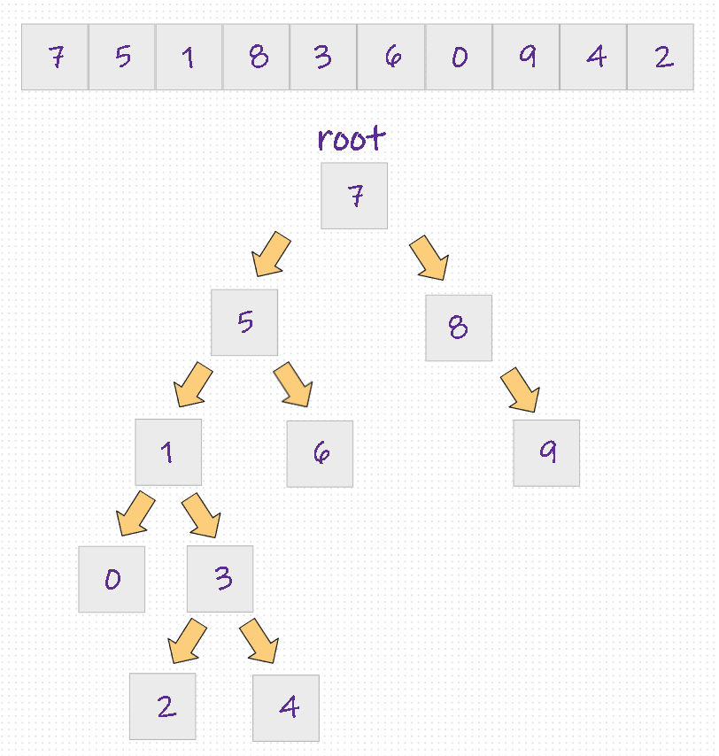

# Proje 3

* [7, 5, 1, 8, 3, 6, 0, 9, 4, 2] dizisinin Binary-Search-Tree aşamalarını yazınız.

  Örnek: root x'dir. root'un sağından y bulunur. Solunda z bulunur vb.

---

* root: 7

* 5 :
  * 7'den küçük olduğu için 7'nin solunda bulunur.
* 1 :
  * 7'den küçük olduğu için 7'nin solunda bulunur.
  * 5'den küçük olduğu için 5'in solunda bulunur.
* 8 :
  * 7'den büyük olduğu için 7'nin sağında bulunur.
* 3 :
  * 7'den küçük olduğu için 7'nin solunda bulunur.
  * 5'den küçük olduğu için 5'in solunda bulunur.
  * 1'den büyük olduğu için 1'in sağında bulunur.
* 6 :
  * 7'den küçük olduğu için 7'nin solunda bulunur.
  * 5'den büyük olduğu için 5'nin sağında bulunur.
* 0 :
  * 7'den küçük olduğu için 7'nin solunda bulunur.
  * 5'den küçük olduğu için 5'in solunda bulunur.
  * 1'den küçük olduğu için 1'in solunda bulunur.
* 9 :
  * 7'den büyük olduğu için 7'nin sağında bulunur.
  * 8'den büyük olduğu için 8'nin sağında bulunur.
* 4 :
  * 7'den küçük olduğu için 7'nin solunda bulunur.
  * 5'den küçük olduğu için 5'in solunda bulunur.
  * 1'den büyük olduğu için 1'in sağında bulunur.
  * 3'den büyük olduğu için 3'in sağında bulunur.
* 2 :
  * 7'den küçük olduğu için 7'nin solunda bulunur.
  * 5'den küçük olduğu için 5'in solunda bulunur.
  * 1'den büyük olduğu için 1'in sağında bulunur.
  * 3'den küçük olduğu için 3'in solunda bulunur.

